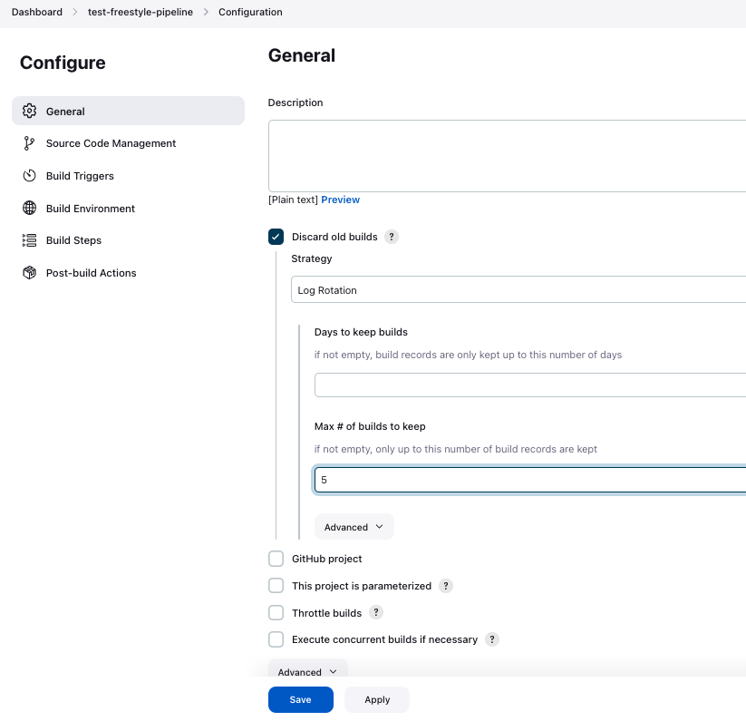

# Project Title

Deploy a Dockerized simple flask app on an AWS EC2 using Docker, Terraform, Ansible, and Jenkins.

## Technology
     

## Description

This project aimed to integrate my knowledge of Docker, Terraform, Ansible, and Jenkins in one simple project.

This project is consists of two parts:

- Provision and configure the needed infrastructure for the jenkins server and the flask webapp using terraform and EC2 user data scripts.
- Build, and Deploy the python flask app on EC2 using Jenkins, and Ansible when any change ocurred on the main branch.

### Github Repositories
1- https://github.com/anas1243/deployment-automation-with-terraform-ansible-jenkins

2- https://github.com/anas1243/python-app-CI-Jenkins

3- https://github.com/anas1243/public-network-terraform-module

Network module that I'm using to provision simple vpc, gateways, and subnets for testing purposes. I only pass the variables values according to the use case.

## Getting Started

### Dependencies

Most of the tools are installed on the services using Ec2 user data you only need to install Terraform and AWS CLI in order to provision the infrastructure.

* [Terraform](https://developer.hashicorp.com/terraform/tutorials/aws-get-started/install-cli)

* [AWS CLI](https://docs.aws.amazon.com/cli/latest/userguide/getting-started-install.html)


### Steps Followed:

1- Configure AWS CLI

```aws configure```

Then put you access key and your secrets access key

2- Clone the git repo

```git clone https://github.com/anas1243/deployment-automation-with-terraform-ansible-jenkins.git```

3- Provision the infra structure

```cd deploy-jenkins-and-flask-app-terraform/infra && terraform apply```

Accept the prompt


4- Configure Jenkins

Take a look to the Docker file for our Jenkins server at `jenkins/Dockerfile` .In order to trigger ansible, aws, and docker you will find them installed inside the Docker file.


* SSh to the EC2 to run the jenkins container. Find the command at `infra/run-jenkins.sh` file


* Get Jenkins unlock password from `/var/jenkins_home/secrets/initialAdminPassword`


* Install Jenkins Plugins


* Configure authentication and Authorization in Jenkins (optional)

1- Install role-based Access Plugin then enable it from the security Section


2- Add users, and roles and assign them to the roles


* Add Docker hub credentials and ec2 ssh key credentials into Jenkins Credentials


5- Configure The freestyle pipeline

you can file the pipeline script at pipelines/jenkins-freestyle-pipeline

* Create a freestyle pipeline


* Configure logs rotation to save only 5 builds



* Specify the Github repo of the flask web app and the ansible playbook that configures the webapp


* Configure Jenkins to be triggered when any change pushed to the web server repo


* Configure github to send a webhook to the jenkins server when any change is pushed


* Verify the webhook


* Bind docker hub creds in jenkins to environment variables that we will use in the pipeline


* Bind ssh key in jenkins to environment variables that we will use in the pipeline


* Create the pipeline script in the Execute Shell section


## Trigger the pipeline by making changes in the web server code

1- make a change in the webserver code 


2- push the changes to the web servers' github repo


3- Check that the pipeline is triggered


4- Success jenkins build


5- Check the the changes on the webserver by hitting the web server on port 80 and path `automation`
